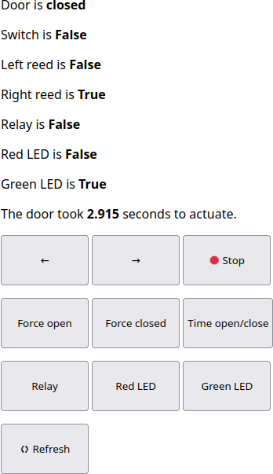

Usage
=====

Assuming you've deployed and configured the Pico at this point it should be ready to boot standalone, but I'd suggest at least initially you start it manually via running ``main.py`` in Thonny so you can view debug output in the console.

Starting in button operation mode
---------------------------------
As previously mentioned, if you want to start without network functionality you need to delete ``/lib/dooropenerpico/credentials.conf`` after which the door opener can be operated by use of the control panel switch. On boot, the red and green LEDs on the control panel flash alternately twice to indicate that the Pico has successfully started.

Starting in network mode
------------------------
Network mode is the default mode the Pico starts in, assuming the presence of ``/lib/dooropenerpico/credentials.conf``. A successful boot looks like the following —

* The onboard LED blinks slowly to indicate that the Pico is attempting to connect to Wifi.
* The onboard LED blinks more quickly to indicate that the Pico is attempting to connect to the MQTT broker.
* The onboard LED goes solid to indicate that a connection has been established.
* The red and green LEDs on the control panel flash alternately twice to indicate that the Pico has successfully started.

At this point the Pico is ready to accept commands via the button on the control panel or via MQTT messages.

.. _console-output:

In the console, a successful boot looks like this —

Starting in web server mode
---------------------------
You can start the Pico with a web server for debugging purposes by holding the switch on the control panel when the Pico starts (when power is applied, or when you start ``main.py`` manually). You can verify that the Pico started in web server mode from the console —

.. warning::
   No security measures are implemented in the web server and this mode is intended for setup and debugging rather than permanent use.

.. _web-server:

If you then navigate to the IP address of the Pico in your web browser, you'll be presented with the following (mobile friendly) page —

The function of the buttons should be fairly self explanatory but there are some things of note —

* The left and right arrows move the servo in those directions. You can also use the left and right keys on your keyboard if you're on a desktop computer. The speed for these actions can be set in ``config.conf`` as detailed in the :ref:`configuration options<configuration-options>` section.
* The stop button stops the servo, but this will not interrupt the current action (i.e. if the door is opening or closing) and is intended for use so that you can set the trim pot appropriately to the stop position on the servo.
* Force open and closed function as named.

.. warning:: 
   Force open and closed don't check the state of the door before attempting to actuate, so be careful you pick the correct button or you could damage the servo.

.. _time-open-close:
   
* Time open/close will time how long the door takes to actuate, see below. This is useful for determining the appropriate timeout setting in ``config.conf``, see the :ref:`configuration options <configuration-options>` section for more details.

* Relay, Red LED and Green LED toggle the state of those devices, useful for testing your wiring.
* Refresh forces the page to retrieve the current state of the door opener.

LED meanings
------------

The various LEDs on the Pico and control panel are all used to indicate status, as such —

**Pico LED**

* Flashing slowly means the Pico is attempting to connect to wifi.
* Flashing quickly means the Pico is attempting to connect to the MQTT broker.
* Solid illumination means that a connection to both wifi and the MQTT broker has been established.

**Green LED**

* Pulsing means the door is closing.
* Solid illumination means the door is closed.

**Red LED**

* Pulsing means the door is opening.
* Solid illumination means the door is open.
* Flashing means the door is in the error state, and the last action was aborted. This could be because the door was already in the state requested (e.g. recieved an MQTT open message when the door was already open) or because the door opener couldn't determine whether it was open or closed.

