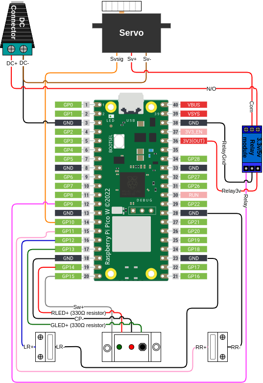

.. include:: global.rst

Wiring and assembly
===================

General guidelines
-------------------
It is difficult to give specific instructions with regards to how to mount and wire everything as your chicken coop is likely slightly different to mine, so I'm only going to provide general guidelines in this section. With that in mind —

* You might want to try initially wiring everything indoors to ensure you have the basic functionality working, but there's obviously only so far you can go without having the parts actually mounted to your coop. At minimum you'll probably want to copy the code to the Pico, but as every setup is likely to be slightly different I'll leave it to your judgement as to when to actually mount everything.
* Refer to the :doc:`video and images <video>` section for an idea of how everything fits together once mounted. The Pico case also has mounting points for screws in case you need them, but mine is in a plastic box around the side of the coop and is not mounted. You'll need to attach —

  * The control panel to a suitable position where you can access the switch easily.
  * The reed switch mounts such that they mate with the magnets mounted either side of the door, in both open and closed positions.
  * The door opener so the centre of the rack is aligned with the centre of the door, and can fully retract and open the door.
  * The rack bracket with the centre of the door, so the back of the bracket is aligned with the edge of the door. 

* You'll use the female dupont cables to connect to the Pico headers, you'll generally need to splice these with the suggested wires for components that are some distance away from the Pico, like the reed switches, control panel and so on.
* On the control panel, you should connect the negative side of the switch and cathode (negative) sides of the red and green LEDs together so they can be connected to a single ground on the Pico side. If you're using a Cat5 cable as suggested, the easiest way to do this is to use individual wires on the control panel side and solder them all together at the far end before splicing all three wires to a single black female dupont cable.
* You'll need to solder a 330Ω resistor inline with the anode (positive) side of both the green and red LEDs, I tacked these between the far end of the cables and put heatshrink over them.

Wiring diagram
--------------
You need to wire all the electronic components as per the following diagram —

In tabular form (this table is laid out in the same manner as the diagram i.e. Micro USB connector at the top) —

.. list-table::
   :header-rows: 1
   :align: left

   * - GPIO pin
     - Name
     - 
     - Name
   * - 
     - /
     - 
     - /
   * - 
     - /
     - 
     - /
   * - /
     - DC- / Servo -
     - 
     - Relay -
   * - 
     - /
     - 
     - /
   * - 
     - /
     - 
     - Relay 3v
   * - 
     - /
     - 
     - /
   * - 
     - /
     - 
     - /
   * - 
     - /
     - 
     - /
   * - 
     - /
     - 
     - /
   * - 
     - /
     - 
     - /
   * - 
     - /
     - 
     - /
   * - 9
     - Relay signal
     - 
     - /
   * - /
     - /
     - 
     - Right reed -
   * - 10
     - Servo signal
     - 
     - /
   * - 11
     - Right reed +
     - 
     - /
   * - 12
     - Left reed +
     - 
     - /
   * - 13
     - Green LED +
     - 
     - /
   * - /
     - Control panel -
     - 
     - Left reed -
   * - 14
     - Red LED +
     - 
     - /
   * - 15
     - Switch +
     - 
     - /
